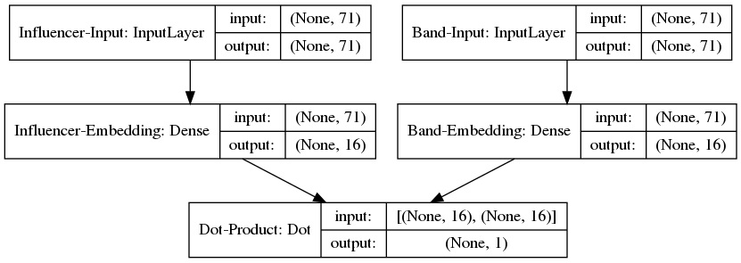
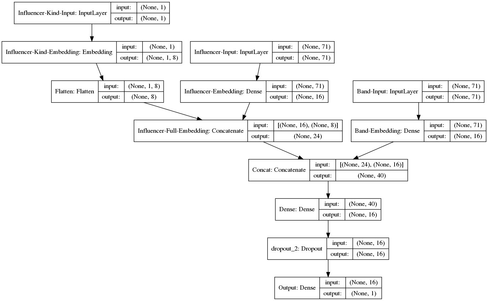
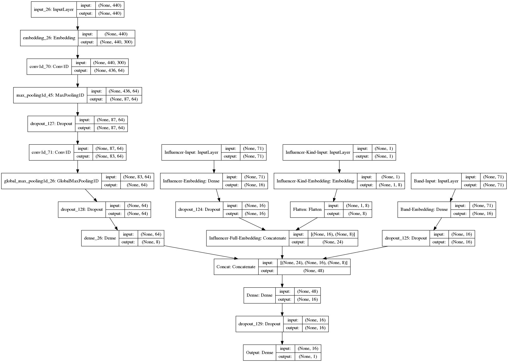

## Introduction

Nous construisons un système de recommandation **Content-Based**, qui va attribué une note à chaque couple influenceur/chanson. Ce système peut être utilisé pour recommander des influenceurs à un groupe ou inversement plusieurs chansons à un influenceur en fonction du score prédit (on recommande les items dans l'ordre décroissant des scores).

Les articles joints et la litérature tendent à considérer que les sytèmes de recommandations basé sur le **Collaborative Filtering** sont plus performants que les systèmes de recommandation **Content-based**. Cependant, ces derniers ne permettent pas de traiter le problème du **Cold Start**. C'est pourquoi, une approche **Content-Based** est préférable dans un cas d'usage où des labels et artistes indpendants se renouvellent rapidement. Pour plus de performance, on peut également opter un modèle hybride.

De plus, le dataset contient du feedback explicite, plus facile à traiter, mais de musique nouvelle pas nécessairement populaire.

## Approche choisie

Keras a été utilisé pour sa simplicité et sa rapidité de prototypage.

1. Notebook `02_first_models.ipynb`

Pour mesurer les performances des modèles, 5 folds sont choisis pour validation croisée. Les modèles sont donc entraînés 5 fois, et la performance étudiée est la moyenne des RMSE sur les 5 out of folds.
Lorsque du early stopping est utilisé, 10% de la donnée d'entraînement est prise aléatoirement, pour ne pas biaiser les performances sur le out of fold.

Des splits stratifiés sont utilisés pour répartir les 4 notes différentes. Cette approche ne doit pas être utilisée si les influenceurs ont la possibilité de mettre n'importe quelle note entre 0 et 1, ce qui ne semble pas être le cas ici.

Les réseaux de neurones sont comparés au random, au modèle naïf (qui prédit toujours la moyenne des scores sur chaque train), et à un LGBM entraîné avec les genres des artistes, des influenceurs, ainsi le `influencer_kind`.

J'ai choisi de construire un premier système de recommandation à partir des genres préférés des influenceurs (embedding des influenceurs à partir de ces varibales booléennes), et à partir des genres associés à chaque artiste (embedding des artistes à partir de ces variables booléennes).

Pour ce faire, une couche dense va créer l'embedding des genres pour les influenceurs, et une couche dense va créer l'embedding des genres pour les artistes. On prend ensuite le produit scalaires de ces deux embeddings pour obtenir la note. (fonction `build_Dot_model`)

Dans un deuxième temps, j'ai incorporé la variable catégorielle `influencer_kind` pour enrichir l'embedding des influenceurs. Une couche d'embedding catégorielle vient traiter cette variable, et l'output est concaténé avec la sortie de l'embedding des genres, ce qui va constituer l'embedding des influenceurs. Cette fois, au lieu de prendre le produit scalaire des deux embeddings, comme pour la Factorisation de Matrice classique, je concatène les deux embeddings et ajoute une couche dense, pour complexifier l'opération entre les embeddings grâce à une non-linéarité. (`build_NN_model`).

Les modèles sont entraînés avec l'optimiseur Adam, la MSE comme loss, et du Dropout pour régulariser les derniers modèles.

2. Notebook `03_final_models.ipynb`

Dans ce notebook, le texte `track_info` est traité et incorporé au modèle, pour obtenir un embedding des chansons. En effet, les notes sont attribuées par couple influenceur-chanson et non par couple influenceur-artiste, ce qui limite la pertinence des modèles précédents. La seule information disponible pour créer un embedding des chansons est `track_info`, la description de la chanson par l'artiste, en français ou en anglais. Le fait que l'anglais et le français soient utilisés limite l'usage d'embeddings pré-entraînés sur un langage donné. Cependant, la taille des données rend difficile l'entraînement d'embeddings customs. C'est pourquoi, puisque la majorité des textes sont en francais, des embeddings pré-entraînés sur un corpus français (https://fasttext.cc/docs/en/crawl-vectors.html) sont choisis et incorporés directement au modèle. Pour un texte donné, on obtient donc une séquence embeddée du texte de la chanson, traitée par des Convolutions 1D (plus facile à entraîner que des LSTM), du Global Pooling et une couche dense. On obtient un embedding de la chanson, qui va être à son tour concaténé avec les embeddings influenceurs et artistes, puis une (ou plusieurs) couche dense va traiter ces trois embeddings et constituer le score final.

Le Learning Rate est réduit au fur et à mesure de l'entraînement avec ReduceLROnPlateau de Keras utilisé sur la MSE du valid.

## Résultats

* Random: ~0.55
* Naïf: 0.3957
* LGBM: 0.3088
* Dot model: 0.3162
* 1st NN model: 0.3096
* Final NN model (avec description des chansons):

NB: le score est la 5-fold Cross Validation RMSE

## Enrichissement du modèle avec les données disponibles

Pour enrichir les modèles, on pourrait incorporer les données textuelles côté artistes et côté influenceurs pour améliorer leurs embeddings respectifs. Le traitement serait fait de la même façon que celle décrite dans la section précédente.

De plus, du temps peut être passé à :

1. nettoyer l'ensemble des données textuelles (enlever les stop words par exemple)

2. faire une grid search pour trouver la meilleure architecture

3. tester les Conv1D dilatées pour le traitement des séquences textuelles

## Enrichissement du modèle avec des données acoustiques

### Résumé des articles

1. [Automatic tagging using DCNN](https://arxiv.org/pdf/1801.05134.pdf)

* Classifying music samples from MTT and MSD (with last.fm tags) into top 50 tags
* DCNN on mel-spectrogram perform better than on hand crafted sound features (STFT, MFCC) for classification task
* Deeper CNN perform better when more data is used for training (MTT vs MSD)
* In theory, CNN on mel-spectrogram can capture chords, beats, tonality, temporal envelopes, and have properties like translation, distortion and local invariance interesting when dealing with music
* Small kernel size: reduced number of parameters (train faster, less VRAM needed) and invariance property (cf previous bullet point)
* 2D convolutions: learn both temporal and spectral structures, useful for music
* FCN : fully convolution networks (and not fully connected networks) : use of global pulling at the end

Limits:
* The article is not clear about the splitting strategy on MTT dataset, and results might not be reproducible.
* Dropout + Batch Norm is proposed, which can be harmful : Batch Norm during training accumulates statistics biased by dropout, which can cause a drop of performance during inference when dropout is turned off, cf [Dropout and BatchNorm](https://arxiv.org/pdf/1801.05134.pdf).

2. [Deep content-based music recommendation](https://arxiv.org/pdf/1807.06786.pdf)

* Collaborative Filtering : performs better but cold start problem. Also: difficult to recommend unpopular songs when training data is small, and not useful to recommend songs that user has already played
* semantic gap between song characteristics and user preference (embeddings/ latent-factor vectors)
* MSD is used for training, getting audio clips of 29s from 7digital.com, usage data from Echo Nest Taste Profile Subset, Last.fm for tags
* interesting approach for dealing with implicit feedback (no explicit rating from user): Weighted Matrix Factorization (WMF), terms in MSE (difference between user-song predicted positive/negative interaction and actual interaction) are weighted by a confidence term (increasing with user play count of song) ==> does not really deal with unpopular songs being scarcely recommended
* approach proposed consists in predicting latent factors from content data (sound data). Latent factores are given by a collaborative filtering approach using WMF
* audio tagging performs better with latent-factors data than with processed content data (Logistic Regression )

* Predicting music latent factors

    * 50D latent vectors
    * approach 1: hand crafted sound features (MFCC), vector-quantize with K-means, bag-of-words aggregation, PCA for dimensionality reduction and Linear Regression for prediction
    * approach 2: CNN on mel-spectrogram
    * 2 losses used: MPE (from WMF) and MSE. MPE performs worst presumably because of popular songs being predicted well (larger errors if play count is large)

* Recommender system
    * user latent factors : average of latent factors of all songs a user has listened to
    * MAP500 and AUC monitored for performance
    * CNN trained with MSE performs better
    * collaborative filtering much more powerful

Limits : not end-to-end and rating can only be `xT.y`

3. [End-to-end learning for music audio tagging at scale](https://arxiv.org/pdf/1711.02520.pdf)

* domain knowledge based architectures: time aggregation filters, frequency aggregation filters (1DConv)
* domain knowledge independant architecture: small 2DConv filters
* domain knowledge based architectures limit model's capabilities to learn from data
* MTT and MSD data are used from benchmark, as well as a large Private Dataset
* processing waveforms vs mel-spectrogram (front end) + same backend for tagging
* same perf for 3x3 Conv2D vs vertical + horizontal filters: but 3x3 Conv = more parameters => horizontal+vertical chosen
* 3x1 vertical CNN chosen for front end waveforms
* MSE for Private Dataset, Log Loss for others
* Models trained on waveforms outperform models trained on mel-spectrogram on Private Dataset, not on MSD and MTT
* Conclusion: models trained on waveforms are more efficient if enough data is available, because they are not knowledge based
* PR-AUC is monitored for unbalanced datasets

Limits:
* Waveform approach is more efficient on a dataset that is not available, so results are not reproducible
* Frequency data is missing from waveform data, ml-spectrogram are consequently more interesting

### Approche choisie:

On pourrait enrichir le modèle actuel avec des embeddings de chansons tirés de la donnée musicale (concatenation avec les embeddings de description des chansons).

Voici comment seraient constitués ces embeddings :

1. Entraînement d'un FCNN sur mel-spectrogram (possibilité d'utiliser les poids de [MUSICNN](https://github.com/jordipons/musicnn) comme warm start, `MSD_musicnn_big` par exemple) à prédire les facteurs latents des chansons du Million Song Dataset en minimisant la MSE (les mel-spectrogram seraient obtenus grâce à 7digital.com, les facteurs latents grâce à une WMF avec les données d'usage (play count) du MSD, et de Last.fm). Le FCNN sera de profondeur >= 5 et les convolutions 1D-vertical + 1D-horizontal, ou 3x3 selon la puissance de la machine d'entrainement, s'il est entraîné from scratch.

2. Utilisation du FCNN dans le modèle de reco proposé pour créer les embeddings et minimiser la MSE sur le dataset Groover. Possibilité de fine-tuner les poids du FCNN au moment de l'entraînement avec la donnée Groover.

3. Si les données disponibles sont suffisament abondantes, possibilité d'entraîner le FCNN sur les waveforms plutôt.